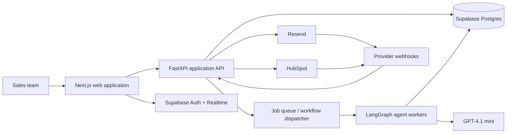

# SalesOS Architecture

**Product:** SalesOS  
**Status:** Production architecture for MVP and scale  
**Design principle:** AI prepares work; customers retain control over external actions.

## 1. System Overview

SalesOS is a multi-tenant SaaS platform that turns an outbound campaign brief into researched accounts, researched decision makers, personalized email drafts, approved sends, CRM updates, conversation visibility, and reporting.

The platform is intentionally split into a responsive product experience, a deterministic application API, and an asynchronous AI/workflow layer. This separation keeps user-facing operations fast, makes all consequential actions reviewable, and prevents long-running research or model calls from blocking the core product.

The core system of record is Supabase Postgres. The product never treats model output as a source of truth without recording its source, confidence, and review state. In the MVP, sending is a state transition that requires an explicit approval event.

## 2. High-Level Architecture

### Architectural boundaries

- **Next.js on Vercel** delivers the authenticated dashboard and lightweight server-side presentation needs.
- **FastAPI on Railway** owns business rules, permissions, integration credentials, webhook processing, and write operations.
- **Supabase** provides identity, Postgres, secure file/object storage where required, and realtime updates for durable product state.
- **LangGraph workers on Railway** execute durable, observable research and content-generation workflows outside the request path.
- **External providers** are called through narrowly scoped adapters so delivery, CRM, and model providers can change without rewriting product logic.

## 3. Frontend Architecture

The frontend is a Next.js 15 application written in TypeScript and deployed to Vercel. It uses Tailwind CSS and shadcn/ui to provide a consistent, accessible, fast product interface.

### Product surfaces

- **Workspace and onboarding:** organization setup, members, CRM connection, sending configuration, and outbound policies.
- **Campaign workspace:** ICP, messaging brief, target-account list, campaign settings, and operational status.
- **Research review:** account and decision-maker briefs that distinguish source-backed facts from AI inference.
- **Approval queue:** a high-throughput review surface for editing, approving, rejecting, and inspecting message evidence.
- **Conversation inbox:** reply state, message history, handoff context, and recommended next action.
- **Reporting and audit:** weekly performance, activity history, integration health, and immutable action records.

### Frontend responsibilities

The frontend renders data and captures user intent; it does not contain authorization policy, sequence logic, approval enforcement, or provider secrets. It calls the FastAPI service for business operations and uses Supabase only for approved identity/session and realtime use cases.

Optimistic UI is permitted only for reversible presentation changes. Consequential operations—such as approval, send scheduling, or CRM synchronization—must display the confirmed server-side state. Realtime subscriptions refresh job progress, approvals, conversations, and integration status without polling-heavy dashboards.

## 4. Backend Architecture

FastAPI is the application control plane. It exposes versioned REST APIs for the web app, receives authenticated provider webhooks, validates all commands, and writes canonical state to Postgres.

### Domain services

- **Workspace and access service:** tenant membership, roles, policy enforcement, and entitlement boundaries.
- **Campaign service:** campaign configuration, eligibility rules, target progression, and sequence lifecycle.
- **Prospect service:** account/contact identity, deduplication, enrichment state, and research lifecycle.
- **Content service:** draft versions, evidence links, editing, approval state, and content policy checks.
- **Delivery service:** approved-send scheduling, Resend interaction, event reconciliation, suppression, and idempotency.
- **CRM service:** HubSpot object mapping, sync orchestration, conflict handling, and retry visibility.
- **Conversation service:** messages, reply events, classification results, stop conditions, and human handoff.
- **Audit service:** append-only event capture for all material user, system, agent, provider, and administrator actions.

### API conventions

All write commands are authenticated, tenant-scoped, authorization-checked, idempotent where retried, and recorded in the audit log. The API emits work requests rather than running AI research, delivery, or CRM synchronization synchronously. Provider webhook handlers verify authenticity, persist raw receipt metadata safely, and hand off processing to background work.

## 5. AI Agent Architecture

LangGraph orchestrates bounded, durable workflows rather than acting as an unconstrained autonomous agent. Each workflow is a state machine with explicit inputs, tool permissions, transitions, retry limits, approval gates, and terminal failure states.

### Agent workflows

1. **Company research:** gathers permitted source material, extracts structured facts, identifies relevant signals, and creates a source-linked research brief.
2. **Decision-maker research:** selects target roles, resolves contact context from approved data, and separates observed facts from inferred relevance.
3. **Outreach generation:** combines campaign rules, approved research, style guidance, and channel constraints to produce versioned message drafts.
4. **Sequence generation:** creates proposed follow-up steps with timing, stop conditions, and campaign-specific goals.
5. **Reply triage:** classifies inbound replies into bounded states, detects opt-outs and out-of-office responses, and routes uncertain or high-value responses to a human.
6. **Weekly reporting:** aggregates validated activity and outcome data, then generates narrative insights clearly labeled as analysis.

### Model and safety design

GPT-4.1 mini is used for cost-efficient research synthesis, structured extraction, draft generation, and classification. Prompts are versioned and evaluated. Agent outputs must conform to typed schemas before persistence. Grounding sources, prompt version, model version, and generation metadata are stored with each output.

Agents may read only tenant-authorized data and approved external sources. They cannot independently send messages, change CRM ownership, alter policies, or access credentials. The send path requires a human approval record validated by the application API; no LangGraph transition can bypass it.

## 6. Authentication

Supabase Auth is the identity provider for the web application. It supports secure email/passwordless and OAuth-based sign-in options as product requirements evolve. The frontend obtains a session; FastAPI validates the bearer token and resolves the user, workspace, membership, and role server-side.

### Authorization model

- **Owner:** billing, workspace settings, integrations, policies, and full workspace access.
- **Admin:** members, campaigns, approvals, integrations within allowed settings, and reporting.
- **Manager:** campaigns, review policies assigned to their team, approvals, and reporting.
- **Contributor:** research, drafting, assigned campaign work, and permitted approvals.
- **Viewer:** read-only access to selected workspace data and reports.

Every persisted business record carries a workspace identifier. Postgres row-level security provides defense in depth; FastAPI remains the policy decision point for application commands. Service-role credentials are confined to backend infrastructure and never shipped to the client.

## 7. Database Layer

Supabase Postgres is the durable system of record. The data model is tenant-first, relational for correctness, and designed to preserve an event trail alongside current operational state.

### Primary entities

| Domain | Core entities |
| --- | --- |
| Tenancy | workspaces, users, memberships, roles, workspace policies |
| Campaigns | campaigns, segments, target lists, sequence definitions, enrollment states |
| Prospects | accounts, contacts, identities, research briefs, research sources, eligibility decisions |
| Content | outreach drafts, draft versions, personalization evidence, approvals, rejections |
| Engagement | deliveries, message events, conversations, replies, classifications, suppressions |
| Integrations | connections, encrypted credential references, sync mappings, sync runs, provider events |
| Governance | audit events, workflow runs, jobs, prompt/model metadata, error records |

### Data design principles

Current state is modeled explicitly for fast product queries; immutable events preserve how that state was reached. Critical tables include tenant keys, creator/actor metadata, timestamps, and idempotency identifiers. Unique constraints prevent duplicate prospect identity, duplicate delivery, and duplicate provider-event processing.

Sensitive integration tokens are encrypted and access is restricted to the backend integration service. Any data retention, deletion, export, and access requests are implemented as workspace-scoped, auditable operations. Backups, point-in-time recovery, migrations, and restore tests are part of the operational baseline.

## 8. Integrations

### Resend

Resend handles approved transactional and campaign email delivery. SalesOS stores provider message identifiers, delivery/bounce events, complaints, and suppression states. Webhooks drive authoritative send-status reconciliation. The delivery service enforces campaign controls, approval validation, per-workspace pacing, and opt-out handling before handing work to Resend.

### HubSpot

HubSpot is the MVP CRM integration. OAuth connects a customer workspace with least-privilege scopes. SalesOS maps accounts, contacts, campaign context, activities, and conversation outcomes using a versioned mapping layer. Syncs are idempotent and conflict-aware; failures are visible in the UI and safely retryable.

### AI provider

GPT-4.1 mini is accessed only from the worker environment. Requests apply tenant isolation, prompt templates, structured output validation, rate limits, and cost telemetry. No provider response is treated as permission to perform an external action.

### Integration contract

All external systems are wrapped by provider adapters that normalize authentication, request/response logging, error handling, retries, and idempotency. This allows alternate sending providers, CRMs, data providers, and models to be introduced without leaking provider-specific behavior across the product.

## 9. Background Jobs

Asynchronous work is persisted before execution and processed by Railway-hosted workers. A durable queue abstraction supports retries, exponential backoff, dead-letter handling, observability, and idempotent execution. Job status is written to Postgres and surfaced to the frontend through realtime updates.

### Job categories

- Account/contact research and refresh.
- Draft and sequence generation.
- Approval-triggered delivery scheduling and send reconciliation.
- HubSpot import, export, and retrying synchronization.
- Webhook event processing and conversation classification.
- Scheduled follow-up eligibility checks, suppression checks, and sequence stop logic.
- Weekly metric aggregation and report generation.
- Maintenance tasks such as retention enforcement and integration-health checks.

Workers use narrowly scoped service credentials and are horizontally scalable. A job must be safe to execute more than once; provider calls use idempotency keys and state transitions use transactional guards. Failures move to an operator-visible terminal state rather than disappearing silently.

## 10. Security

SalesOS is designed around least privilege, tenant isolation, traceability, and safe external action.

- Enforce HTTPS, secure headers, CORS allowlists, rate limiting, input validation, and output encoding.
- Validate Supabase JWTs and apply role/workspace checks on every API operation.
- Use Postgres row-level security and tenant-scoped queries as complementary defenses.
- Encrypt secrets at rest; keep credentials out of source code, logs, browser bundles, and model prompts unless strictly necessary.
- Verify Resend and HubSpot webhook signatures, timestamp receipt, and deduplicate events.
- Redact sensitive fields from application and model telemetry; limit logs by retention policy.
- Record auditable events for research, draft generation, edits, approvals, sends, CRM changes, permission changes, and administrative actions.
- Enforce consent, opt-out, suppression, and configured compliance controls before every message is sent.
- Protect against prompt injection by treating external content as untrusted data, limiting tools, using structured outputs, and requiring human approval for external communication.
- Maintain incident response runbooks, dependency scanning, secret rotation, and regular access reviews.

## 11. Scalability

The system scales by keeping web requests stateless, placing long-running work on workers, and using the database for durable coordination.

- Vercel scales Next.js delivery independently from the API and workers.
- Railway runs independently scalable FastAPI and worker services, with workload-specific concurrency and resource limits.
- Postgres indexes tenant keys and high-volume query paths; partitioning and archival policies are introduced as audit and event volumes grow.
- Queue workers scale horizontally by job type, with concurrency limits per workspace and provider to protect quality and rate limits.
- Caching is reserved for safe, derived data such as UI summaries and provider metadata; approval, sending, and audit decisions always read authoritative state.
- Provider adapters use rate-limit awareness, circuit breakers, and backpressure so an external outage cannot cascade across tenants.
- Cost controls include model token budgets, content reuse, research freshness policies, and per-workspace quotas.

## 12. Deployment

### Environments

Development, staging, and production are isolated with separate Supabase projects, Railway services, Vercel environments, credentials, webhook endpoints, and provider configurations. Production data never flows into lower environments.

### Hosting responsibilities

- **Vercel:** Next.js application, preview deployments, edge delivery, and frontend observability.
- **Railway:** FastAPI API service, LangGraph workers, scheduled job runners, and private runtime configuration.
- **Supabase:** managed Postgres, authentication, storage as needed, realtime, backups, and database access controls.

### Release operations

Continuous integration validates types, tests, migrations, security checks, and API contracts before deployment. Database migrations are forward-only and compatible with rolling deployments. Feature flags and staged rollout protect new workflows, integrations, and model prompt changes. Monitoring covers user-facing errors, latency, job age, queue depth, webhook failures, delivery outcomes, CRM sync health, model cost, and approval-to-send integrity.

## 13. Future Expansion

The architecture is intentionally prepared for a broader revenue operating system without prematurely building it.

- Add Salesforce and other CRMs through the integration-adapter contract.
- Add approved enrichment and intent-data providers with source-level provenance and consent controls.
- Support customer-managed data sources, knowledge bases, and brand/style guides through scoped retrieval.
- Introduce additional channels—social-assisted workflows, SMS, calling, and calendar coordination—only with channel-specific compliance and approval policies.
- Evolve from per-message approval to configurable policy-based automation for trusted, low-risk actions, retaining reversible controls and a complete audit trail.
- Add account orchestration, buying-committee coordination, experimentation, prioritization, and forecasting as separate bounded workflows.
- Support enterprise requirements including SSO/SAML, SCIM, granular custom roles, regional data residency, customer-managed keys, advanced retention controls, and comprehensive compliance certifications.

SalesOS should retain the same invariant as it grows: an AI employee can do the work, but the customer can always understand, govern, and override every consequential action.
