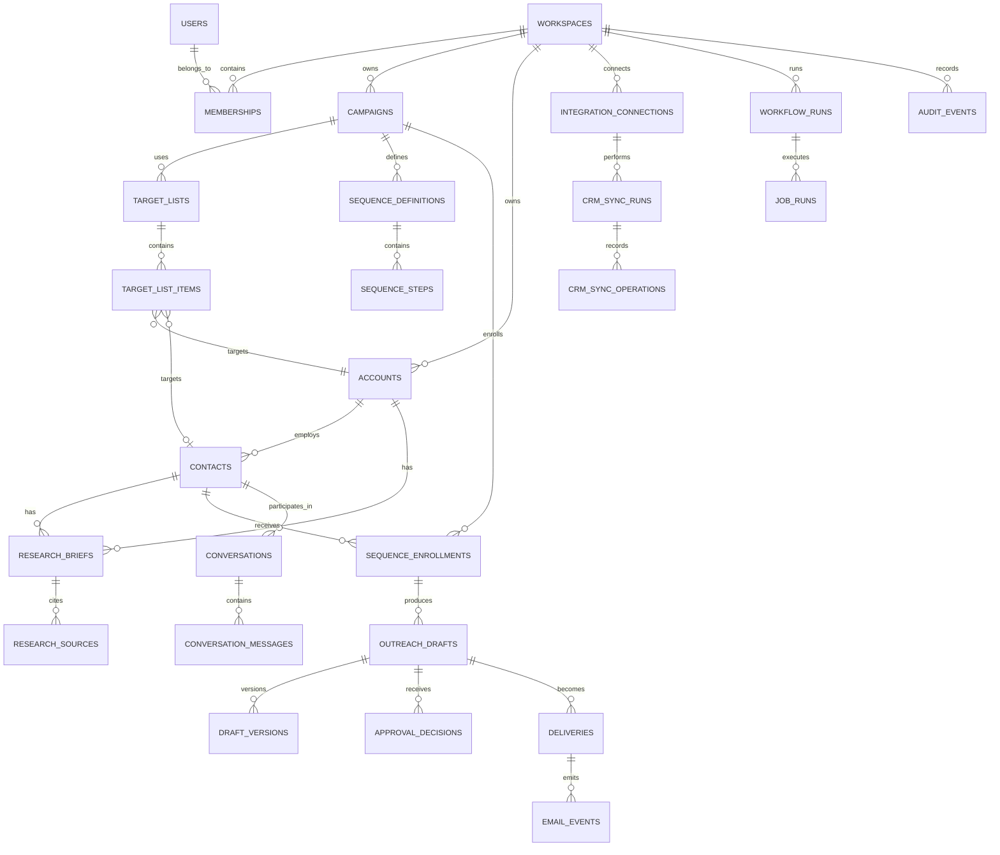

# SalesOS Database Architecture

**Database:** Supabase PostgreSQL  
**Status:** Production implementation blueprint  
**Primary design goal:** Preserve trustworthy, tenant-isolated operational state while retaining a complete history of every consequential action.

## 1. Design Principles

### Tenant isolation by default

SalesOS is a multi-tenant SaaS. Every customer-owned record is associated with exactly one workspace, and tenant scope is enforced in both application logic and PostgreSQL Row Level Security (RLS). Cross-workspace access is never inferred from user identity alone.

### Relational truth, event history

Postgres stores the current operational state needed by the product—such as a draft’s approval status or a contact’s sequence enrollment—alongside immutable events that explain how the state changed. Current-state tables make the application efficient; event tables make it accountable.

### Explicit state machines

High-risk workflows use explicit, validated states and transitions. Drafts, approvals, sends, sequence enrollments, CRM syncs, conversations, and background jobs must not rely on loosely interpreted timestamps or booleans. This is essential to guarantee that a message cannot be sent before required approval.

### Provenance and explainability

Research facts, personalization claims, AI outputs, classifications, and reporting insights retain their source, version, confidence where applicable, and generation context. AI-generated inference is stored separately from source-backed facts.

### Soft deletion for recoverable business records

Customer-managed operational objects—such as campaigns, target lists, accounts, contacts, and drafts—use a `deleted_at` lifecycle where recovery, referential integrity, or auditability matters. Soft-deleted records are excluded from normal product queries but remain available to authorized recovery and retention processes.

### Immutable records for accountability

Audit events, provider webhook receipts, outbound delivery attempts, approval decisions, and finalized model-generation metadata are append-only. Corrections occur as new events or revisions, never by mutating history.

### Idempotent external operations

Every operation that can be retried—email delivery, HubSpot writes, webhook handling, and background jobs—has an idempotency key or provider-event uniqueness rule. The database acts as the coordination layer that prevents duplicates.

### Privacy by design

Store the minimum personal and integration data required for product operation. Classify sensitive fields, restrict visibility through RLS and roles, encrypt credentials, and support workspace-scoped retention, export, and deletion processes.

## 2. Entity Relationship Overview

This diagram shows logical ownership, not every foreign key. Operational tables inherit workspace scope either directly or through a validated parent relationship; frequently queried tables carry `workspace_id` directly for safe, efficient RLS evaluation.

## 3. Core Tables

### Identity, tenancy, and policy

| Table | Purpose | Key production considerations |
| --- | --- | --- |
| `users` | Application profile linked one-to-one to Supabase Auth identity. | Contains non-secret profile attributes; auth credentials remain managed by Supabase Auth. |
| `workspaces` | Customer tenant and top-level data boundary. | Stores lifecycle, plan/entitlement references, timezone, and soft-delete state. |
| `memberships` | User-to-workspace membership and role assignment. | Unique per user/workspace; active status and role changes are auditable. |
| `workspace_policies` | Configurable approval, sending, retention, and compliance rules. | Versioned policy snapshots are referenced by consequential workflow decisions. |
| `workspace_domains` | Approved customer sender/brand domains. | Supports sender identity validation and policy checks. |

### Campaign and prospect data

| Table | Purpose | Key production considerations |
| --- | --- | --- |
| `campaigns` | Campaign brief, offer, ICP, status, owner, and operating configuration. | Soft deletable; status follows an explicit lifecycle such as draft, active, paused, completed, archived. |
| `target_lists` | Named collections of target accounts and contacts. | Can be reusable or campaign-scoped; import source and eligibility rules are retained. |
| `target_list_items` | Membership of accounts/contacts in a target list. | Captures eligibility, exclusion, source, and decision rationale; must deduplicate list membership. |
| `accounts` | Companies targeted or imported into a workspace. | Uses normalized identity fields such as canonical domain; soft deletion and merge history prevent loss of context. |
| `contacts` | Decision makers and professional contact data. | Tied to an account when known; handles identity resolution, consent/suppression status, and soft deletion. |
| `account_aliases` / `contact_identities` | Alternate domains, external IDs, email addresses, and provider identifiers. | Unique within a workspace/provider namespace; supports safe deduplication and HubSpot correlation. |
| `research_briefs` | Versioned company or decision-maker research output. | Records subject, source freshness, workflow run, model metadata, review state, and soft-delete state for drafts. |
| `research_sources` | Source-level evidence attached to a research brief. | Stores URL/reference, retrieval timestamp, excerpt/structured fact reference, source type, and provenance classification. |

### Content, approval, and campaign execution

| Table | Purpose | Key production considerations |
| --- | --- | --- |
| `sequence_definitions` | Campaign-level sequence configuration. | Versioned definitions prevent later edits from rewriting active enrollment history. |
| `sequence_steps` | Ordered steps, delay rules, channel, and stop conditions. | Immutable once used by an active enrollment; revisions create a new sequence version. |
| `sequence_enrollments` | A contact’s participation in a sequence. | Explicit lifecycle includes pending approval, active, paused, stopped, completed, and failed. |
| `outreach_drafts` | Current logical message draft for a contact, campaign, and sequence step. | Holds current status and references current approved version; never doubles as a sent-message record. |
| `draft_versions` | Immutable content revisions created by AI or humans. | Stores body, subject, source/evidence references, author type, prompt/model metadata, and edit lineage. |
| `approval_requests` | Approval work item and policy snapshot for a sendable draft version. | Captures required approver scope, expiration, and status; one active request per draft/version as appropriate. |
| `approval_decisions` | Immutable approve, reject, revoke, or escalate decision. | Records actor, timestamp, rationale, approved version, and policy/version used for the decision. |
| `suppressions` | Do-not-contact and compliance controls. | Workspace-scoped with reason, source, effective time, and optional expiry; checked before each send. |

### Email and conversation tracking

| Table | Purpose | Key production considerations |
| --- | --- | --- |
| `deliveries` | A specific, approved request to send a message. | Immutable attempt identity; includes sender, recipient, provider idempotency key, approved version, and state. |
| `delivery_attempts` | Provider submission attempts for a delivery. | Append-only; distinguishes scheduled, submitted, accepted, failed, and reconciled outcomes. |
| `email_events` | Provider-originated lifecycle events. | Append-only webhook-derived events: delivered, bounced, complained, opened/clicked when enabled, and related metadata. |
| `conversations` | Thread-level relationship around a prospect interaction. | Correlates provider thread/message identifiers with campaign, contact, and current state. |
| `conversation_messages` | Inbound and outbound messages in a conversation. | Immutable message content/metadata snapshot; outbound records reference deliveries. |
| `reply_classifications` | Bounded AI/human classification of an inbound message. | Versioned result including confidence, model metadata, escalation status, and human override. |

### Integrations and external synchronization

| Table | Purpose | Key production considerations |
| --- | --- | --- |
| `integration_connections` | A workspace’s provider connection, including HubSpot. | Stores provider, connection status, encrypted credential reference, scopes, and health information—not plain tokens. |
| `external_object_mappings` | Links SalesOS records to provider objects. | Unique per connection, object type, and external ID; supports contact/company/activity correlation. |
| `crm_sync_runs` | A logical HubSpot sync execution. | Captures direction, scope, start/end state, counts, cursor/checkpoint, and error summary. |
| `crm_sync_operations` | Individual create/update/skip/failure action within a sync run. | Idempotency key, payload fingerprint, mapping reference, retry state, and provider response metadata. |
| `provider_webhook_receipts` | Raw receipt registry for Resend and HubSpot events. | Immutable, signature-verification status, provider event ID, safe payload reference, and processing result. |

### LangGraph workflow and platform operations

| Table | Purpose | Key production considerations |
| --- | --- | --- |
| `workflow_runs` | Top-level LangGraph workflow execution. | Stores workflow type, graph/prompt version, subject, input reference, state, checkpoints, cost telemetry, and terminal result. |
| `job_runs` | Individual queued execution or retry. | Tracks queue class, parent workflow, lock/lease state, attempt count, schedule time, idempotency key, and terminal error. |
| `workflow_artifacts` | Structured workflow outputs, checkpoints, and tool results. | Versioned, tenant-scoped, access-controlled; references large payloads stored outside hot relational rows. |
| `report_runs` | Weekly report generation and delivery record. | Stores metric snapshot/version, narrative artifact, recipients, and delivery status. |
| `audit_events` | Immutable cross-domain activity ledger. | Append-only record for every material user, system, agent, provider, and admin action. |

## 4. Relationships

### Ownership hierarchy

`workspaces` is the root owner for all customer data. A user gains access only through an active `membership`. Campaigns, target lists, prospects, integration connections, workflow runs, and audit events belong directly to the workspace. Child entities carry the workspace key when they are independently queried, exposed by API, or protected by RLS.

### Prospect graph

An `account` has zero or more `contacts`. A contact may initially exist without an account during import or resolution, but an association is established when reliable. Research briefs attach to either an account or contact through a constrained subject type and subject identifier. Source records belong to a research brief, not directly to a campaign, enabling evidence reuse without losing provenance.

### Campaign execution graph

A campaign uses target lists and one or more versioned sequence definitions. Eligible list items lead to a contact-level sequence enrollment. Each relevant step may produce one logical outreach draft with many immutable draft versions. Only a specific draft version can receive an approval decision. A delivery references the approved version and approval decision, preserving a cryptographically/structurally clear path from message to authorization.

### Engagement graph

A delivery has zero or more attempts and provider events. Successful sends and inbound messages link into a conversation. Conversation state can stop or pause sequence enrollment, while reply classifications inform the recommended next action. Suppressions override all campaign and sequence eligibility.

### Integration graph

Each integration connection is scoped to one workspace. External-object mappings link canonical SalesOS records to HubSpot objects. A sync run contains granular sync operations, allowing partial failure, retries, and exact auditability without corrupting unrelated records.

### Workflow graph

LangGraph workflow runs are tenant-scoped and connected to their subject (for example, an account research brief or a draft generation request). A workflow may have multiple job runs because of retries, scheduled continuation, or recovery. Workflow artifacts, model metadata, and audit events retain the causal chain from input to generated output.

## 5. Indexing Strategy

Indexes are selected from observed product query paths, not added indiscriminately. Every high-volume index begins with tenant scope where possible, which improves both RLS-constrained queries and operational isolation.

### Baseline indexes

- Primary keys use UUIDs or time-sortable identifiers suitable for distributed writes.
- Foreign keys are indexed, especially on workspace, campaign, account, contact, integration, and workflow relationships.
- Active-record partial indexes exclude rows with `deleted_at` set for primary product lists.
- Composite indexes support common workspace views: `(workspace_id, status, updated_at)`, `(workspace_id, created_at)`, and domain-specific variants.
- Unique indexes enforce one membership per user/workspace, one identity per workspace/provider namespace, one processed provider event per provider/event ID, and one active enrollment per campaign/contact/sequence version where appropriate.

### Workload-specific indexes

| Query pattern | Index approach |
| --- | --- |
| Approval queue | Workspace, pending status, campaign/assignee, and queue creation/priority; partial to active requests. |
| Campaign dashboard | Workspace/campaign plus lifecycle status and recent update timestamp. |
| Account and contact lookup | Workspace plus canonical domain, normalized email, or provider external ID; use uniqueness where identity policy permits. |
| Sequence scheduler | Enrollment state, next eligible timestamp, workspace, and sequence step; partial to schedulable active enrollments. |
| Delivery reconciliation | Provider, provider message ID, delivery state, and scheduled/send time. |
| Conversation inbox | Workspace, current conversation state, last message timestamp, assigned user/team. |
| HubSpot sync | Connection, sync status, external object mapping, retry timestamp, and provider cursor/checkpoint. |
| Job workers | Queue class, state, scheduled timestamp, lease expiration, and priority; partial to runnable jobs. |
| Audit explorer | Workspace, event timestamp descending, actor, entity type/entity ID, and action type. |

### Growth considerations

Audit, email-event, webhook, and job-run tables are expected to dominate write volume. They should use append-friendly timestamps, targeted indexes, and a documented archival/partitioning plan before volumes make maintenance expensive. Large raw payloads and artifacts should be stored in Supabase Storage or a controlled object store, while Postgres retains metadata, hashes, access controls, and references. Full-text and semantic search are introduced as dedicated, measured capabilities rather than overloading transactional indexes.

## 6. Multi-Tenant Model

The workspace is the SalesOS tenant boundary. A user may belong to multiple workspaces, each with independent data, integrations, policies, and reporting.

### Required tenant-scoping rules

- All customer-owned tables include `workspace_id` unless tenant ownership is safely and exclusively derived from a parent record and the table is not queried independently.
- API commands resolve the active workspace from a verified membership; callers cannot select arbitrary workspace identifiers without authorization.
- Foreign-key relationships must prevent parent/child records from being joined across workspaces. Composite tenant-aware constraints are preferred for high-risk relationships.
- Background jobs and agent workflows persist workspace scope at creation and revalidate it at execution.
- Provider callbacks are resolved through an integration connection, then validated against its workspace before any data mutation.
- Cross-tenant operations are prohibited in application code and RLS. Platform support access, if introduced, uses tightly scoped, audited break-glass controls outside normal customer roles.

### Lifecycle and retention

Soft deletion supports accidental recovery and referential history. Product queries use active-record views or filters by default. A retention service permanently purges eligible soft-deleted records only after contractual retention windows, legal holds, and audit requirements are evaluated. Immutable audit events retain a minimal, privacy-appropriate reference after related business data is purged.

## 7. Security & RLS Strategy

Supabase PostgreSQL RLS is enabled on every tenant-owned table, including child tables that might otherwise be reachable through direct client access. The database denies access by default.

### RLS policy approach

- Authenticated users can read a row only when an active membership grants access to its `workspace_id`.
- Write access is limited by role and operation. For example, contributors may create research requests but cannot approve on behalf of a restricted approver; viewers cannot mutate operational data.
- Policies use server-verified identity claims and membership tables, not client-supplied role or tenant values.
- Insert and update checks ensure the proposed `workspace_id` matches an authorized membership and cannot be reassigned across tenants.
- Soft-deleted rows are hidden from normal user policies unless a recovery role and explicit query path permit access.
- Audit and immutable event tables deny customer mutation; only a trusted backend path may append events.

### Service access

The browser uses the Supabase anonymous key only with RLS-protected access. FastAPI and controlled workers use service credentials exclusively in server-side environments and apply their own authorization and tenant checks before database operations. Direct service-role access is minimized, logged, and never exposed in frontend bundles.

### Data protection controls

Integration tokens are encrypted at rest and represented in relational tables only by encrypted values or secret-manager references. Sensitive message content, contact data, and raw provider payloads have restricted columns/tables, role-based UI exposure, safe logging rules, and retention controls. Backups and restore procedures preserve tenant isolation and are regularly tested.

## 8. Audit Logging

`audit_events` is an append-only, immutable ledger for the actions that matter to customer trust, compliance, support, and incident response.

### Event contents

Each event records:

- Workspace identifier and event timestamp.
- Actor type and identifier: user, API client, worker, LangGraph agent, provider webhook, or system process.
- Action name and resource identity: entity type, entity ID, and optional parent context.
- Correlation, request, workflow, job, and idempotency identifiers where applicable.
- A minimal before/after or change summary, with sensitive values redacted or referenced rather than duplicated.
- Policy version, approval context, provider/model metadata, IP/user-agent when appropriate, and outcome/error classification.

### Events that must be captured

- Membership, role, workspace policy, and integration changes.
- Campaign, target, account, contact, suppression, and research lifecycle changes.
- Every model/agent workflow start, transition, output acceptance, failure, and retry.
- Draft creation, revision, evidence update, approval request, approval decision, revocation, and rejection.
- Delivery scheduling, submission, provider acceptance/failure, webhook receipt, and final delivery status.
- HubSpot sync initiation, individual object operation, conflict, retry, and completion.
- Conversation imports, reply classifications, sequence stop events, and human overrides.
- Administrative access, exports, retention operations, and security-relevant failures.

### Immutability guarantees

Application roles receive no update or delete permissions on audit events. The backend appends through a restricted interface; database governance prevents modifications after insert. Corrections are represented by a subsequent event referencing the original. Audit-event access is tenant-scoped and role-limited, with elevated support access separately logged. Partitioning and archival retain queryability while preserving the chain of custody.

## 9. Future Expansion

The schema should grow by adding bounded domains and provider adapters, not by weakening the tenant or audit model.

- **Additional CRMs:** Salesforce and other providers use new connection, mapping, and sync-operation types while retaining the same canonical account/contact/activity model.
- **Additional channels:** LinkedIn-assisted tasks, SMS, calling, and calendar coordination introduce channel-specific delivery, consent, and event tables, all tied to approval and conversation records.
- **Enterprise controls:** add organization hierarchies, teams, custom roles, SSO/SCIM metadata, regional storage policy, legal holds, customer-managed keys, and advanced data residency.
- **Data intelligence:** add buying signals, enrichment providers, account scoring, experiments, and attribution as source-provenanced, tenant-scoped domains.
- **Policy-based autonomy:** configurable policy evaluations can authorize narrowly safe actions, but each policy decision, condition, and resulting action remains recorded and reversible.
- **Analytics at scale:** replicate or transform anonymized operational events into a warehouse for heavy reporting, while Postgres remains the authoritative transactional database.
- **Model evolution:** model registries, prompt evaluation results, feedback labels, and workflow versioning support changing AI providers without losing reproducibility of historical outputs.

The non-negotiable database invariant is simple: every SalesOS action must be attributable to one workspace, authorized by policy, recoverable when appropriate, and explainable after the fact.
